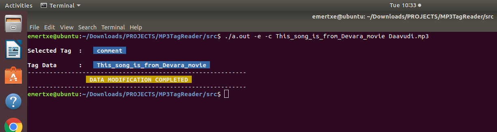

# MP3_Tag_Reader_Project

## Overview
The **MP3 Tag Reader** project is designed to extract and display metadata from MP3 files, such as song title, artist, album,   year, content type, and other ID3 tag information. This tool allows users to retrieve and analyze MP3 metadata efficiently, making it useful for media organization, music library management, and automated tagging processes.

## Features

- Reads and extracts **ID3 metadata** from MP3 files.

- Displays metadata such as **Title, Artist, Album, Year, Content Type, and Comments**.

- Provides a **command-line interface** for user-friendly interaction.

- Efficient file handling for quick retrieval of tag information.

## Implementation Details

- **File Handling:** Uses binary file operations to parse MP3 metadata.

- **Data Extraction:** Reads tag data structures, decodes values, and presents them in a readable format.

- **Error Handling:** Ensures robustness by handling missing or corrupt tags.

## Usage

    Prerequisites

        A Linux-based system or Windows with GCC installed.

        Basic knowledge of terminal commands.

    Clone the Repository:

        git clone <repository-url>
        cd <repository-folder>

    Compile the Code on windows machine:
        Use the GCC compiler to compile the source files:

        gcc -o MP3tag_reader <all files> -lm

    Run the program on windows machine:
    
        To view:

            ./MP3tag_reader -v <filename.mp3>

        To edit:

            ./MP3tag_reader -e -[t/a/A/g/c/y] <data> <filename.mp3>

    Compile the Code on linux machine:

        gcc *.c

    Run the program on windows machine:
    
        To view:

            ./a.out -v <filename.mp3>

        To edit:

            ./a.out -e -[t/a/A/g/c/y] <data> <filename.mp3> 

## Technologies Used

    Programming Language: C

    File Handling: For reading/writing mp3 files.

## Screenshots
View tags:

Edit tag:

After editing:

## File Structure

    main.h: File containing function and structure declarations.

    main.c: Main program file containing function calls and prints the output to the screen.

    ID3_view.h: This program file contains all function declarations related to viewing / printing the tags.

    ID3_view.c: This program file contains function defintions that read tag's metadata from user's mp3 file and prints the 1st 6 tags.

    ID3_edit.h: This program file contains all function declarations related to edit a user defined tag.

    ID3_view.c: This program file contains function defintions that write tag's metadata into user's mp3 file.

    Daavudi.mp3: MP3 file for testing purpose.

    Kissik.mp3: MP3 file for testing purpose.

## Key Challenges & Learnings

- **Understanding MP3 file structure** and ID3 tag formats.

- **Efficient binary file handling** for metadata extraction and insertion.

- **Error handling strategies** for missing or corrupt tags.

## Future Enhancements

- Support for **ID3v3 extended metadata fields**.

- Support for **ID3v1** and **ID3v2** tag formats.

- Batch processing for multiple MP3 files.

- Integration with a **GUI-based metadata editor**.

## Note

- User can able to view / edit **1st 6 tags** of the user's mp3 file.

- This project only supports **ID3v3** tag format.

## Related Projects

This project is part of a portfolio that demonstrates expertise in **file processing and data extraction**. Check out similar projects:

- **[Steganography-Based Secret Text Encoding](https://github.com/OpenSource-Sorcerer/Steganography_Project)** – Hides text data within BMP images using LSB encoding.

- **[Efficient Text Indexing & Retrieval System](https://github.com/OpenSource-Sorcerer/Inverted_Search_Project)** – Implements an **inverted index** for fast word searches across multiple text files.

- **[Arithmetic Precision Calculator (APC)](https://github.com/OpenSource-Sorcerer/APC_Project)** – Performs high-precision arithmetic on large numbers exceeding standard data type limits.

## Contributing

    Contributions are welcome! Feel free to fork the repository, make changes, and submit a pull request. Please ensure that your code adheres to the project’s coding standards.

## License

    This project is released under the **MIT License**.

## Contact

    For questions or suggestions, feel free to reach out:

    Name: OpenSource Sorcerer

    Email: [balanagu77@gmail.com]

## Acknowledgments

    Special thanks to the open-source community for inspiration and resources.
